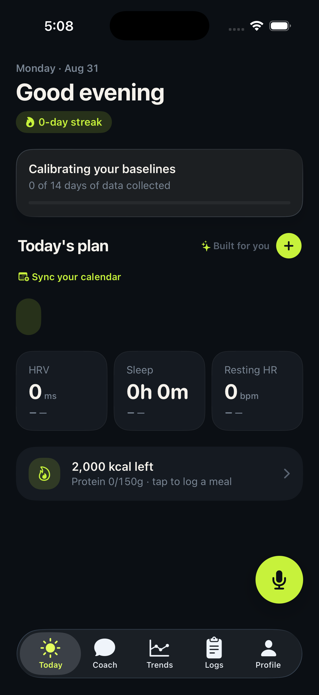
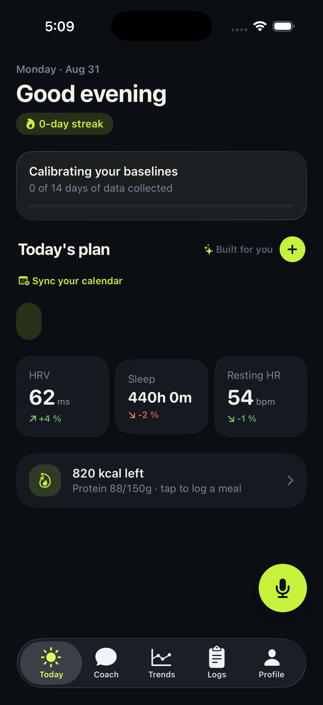
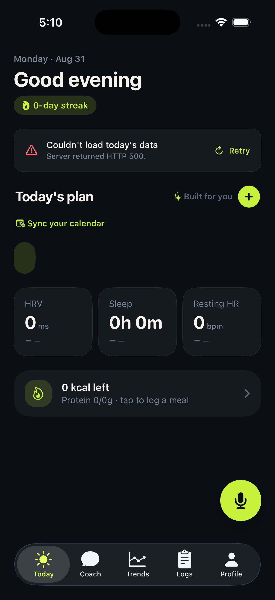
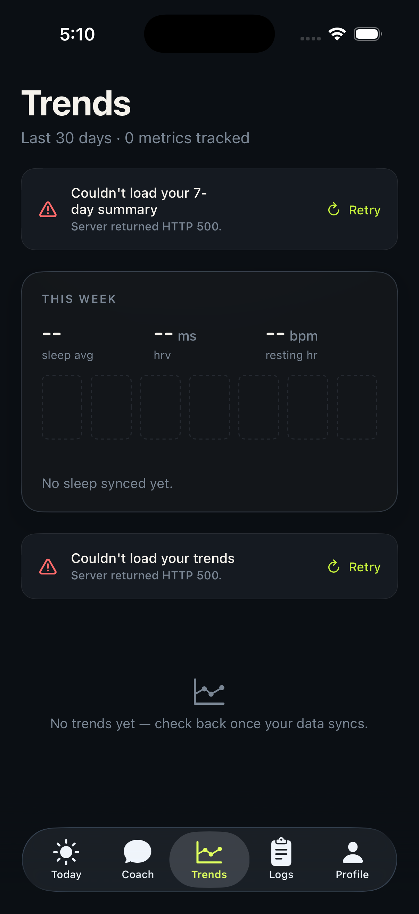

# Vital — End-to-End Product Audit

**Date:** 2026-08-31
**Stage assessed:** about to invite real TestFlight testers
**Method:** full code read (backend + iOS + docs) plus a live simulator pass against a mock
backend, iPhone 17 / iOS 26.2, clean install between scenarios
**Deliverable:** findings and recommendations only — no code was changed

---

## Executive summary

The engineering here is better than the product. There are 511 backend tests running in CI, a
genuinely careful APNs lease/retry/idempotency design, serialized WHOOP token refresh, and a
Trends surface with real VoiceOver and Dynamic Type work. That is above the bar for this stage.

The problem is that two months of work were organized around **building subsystems**, not around
**a stranger's first five minutes**. The last time anyone walked the app as a new user was the QA
pass on **2026-07-03** — which predates the entire Trends rebuild, the units work, the coach
workspace, the nutrition math correction, and the persona work. Everything shipped since then has
been verified as a feature and never as an experience.

Three things follow from that, and they are the whole audit:

1. **The daily brief — the product's core promise — is structurally unable to appear in
   production.** It is cached in process memory on a machine configured to suspend when idle.
2. **The app cannot tell the difference between "no data", "still loading", and "the server
   failed".** All three render as zeros and empty containers, often simultaneously with an error
   banner contradicting them.
3. **A health app that displays `HRV 0 ms` when it means "we don't know" is not a polish
   problem.** It is a trust problem, and trust is the only thing a health app has.

None of this requires re-architecture. The P0 list below is roughly one focused week.

---

## What a tester will actually experience

They install, sign in, and land on Today. They see a `0-day streak`, a card telling them
`Calibrating your baselines — 0 of 14 days of data collected`, and directly beneath it three
tiles reading **`HRV 0 ms`**, **`Sleep 0h 0m`**, **`Resting HR 0 bpm`**. The card is telling the
truth and the tiles are contradicting it on the same screen.

Under a heading that says **"Today's plan · Built for you ✨"** there is nothing at all. Beside it
floats a small empty lime pill — the coach's insight bubble, rendering an empty string.

Tomorrow morning they open the app again. The Fly machine suspended overnight, so the in-memory
brief cache is empty, so the insight is `""` again, so the lime pill is empty again. This repeats
every morning indefinitely.

If the backend has any trouble at all, they get a red card reading **"Server returned HTTP 500."**
— and the zeros stay on screen underneath it.

---

## Evidence

All four captured live in the simulator this session.

| | |
|---|---|
|  | **First run, no data.** The calibration card says `0 of 14 days` while the tiles below assert `HRV 0 ms`, `Sleep 0h 0m`, `Resting HR 0 bpm`. `Today's plan · Built for you` has zero rows. The empty coach bubble is the small lime stub below "Sync your calendar". |
|  | **Real metrics, empty brief** — i.e. a returning user hitting a cold machine. Metrics populate correctly, which isolates the defect: the empty lime pill and the empty "Built for you" plan are driven purely by `insight: ""` / `plan: []`. |
|  | **Server error.** `"Server returned HTTP 500."` verbatim — *and the fabricated zero-state renders underneath it anyway*. |
|  | **Server error, Trends.** Two stacked `HTTP 500` cards, and the screen simultaneously claims `0 metrics tracked`, `No sleep synced yet.`, and `No trends yet — check back once your data syncs.` Failure and emptiness asserted at the same time. |

---

## Findings

Severity is framed for *TestFlight with real testers*, not App Store submission.
**P0** = tester loses trust or hits a dead end · **P1** = visible wrongness ·
**P2** = correctness/process debt · **P3** = real but not blocking

### P0

**1. The daily brief is structurally invisible in production.** *(M)*

A four-link chain, each link in a different file:

- `fly.toml:24-26` — `auto_stop_machines = "suspend"`, `min_machines_running = 0`. The machine
  suspends whenever traffic stops.
- `lib/brain/briefCache.ts:10-12` — the cache is a module-level `Map`, self-documented as
  *"Scope: dev only… In production this would move to Redis or a Postgres table — out of scope
  for now."* Suspension empties it.
- `app/api/today/route.ts:171-186` — on a miss the route returns `insight: ''`, `plan: []` and
  regenerates in the background. The brief takes **15–27s**; the user is long gone.
- `ios/.../DesignSystem/CoachBubble.swift:8` renders `Text("")` with no `isEmpty` guard;
  `PlanTimelineView.swift:24-42` `ForEach`es an empty array inside a `VitalCard`.

A user who opens Vital once each morning — the intended usage — hits a suspended machine every
single time. The `out of scope for now` comment was correct when written; it silently became a
production architecture decision.

> **Fix direction:** persist the brief to Postgres, keyed the way `morning_notification_slots`
> already is. Separately reconsider `min_machines_running = 0`. Independently, guard the two
> iOS views so an empty payload renders nothing rather than an empty container.

**2. Zero is used to mean "unknown".** *(M)*

`TodayViewModel.swift:94` seeds `HRVMetric(value: 0, …)`. The parser at `:364`/`:377`/`:392`
correctly guards with `if let value = m.hrv.value`, so when the backend sends `null` — which it
does, correctly, for a new user — **the seeded `0` simply stays**, and `TodayView.swift:292-316`
renders it unconditionally. The view has no way to distinguish "0 because unset" from "0 because
measured".

The backend is already telling the truth (`"value": null`) and the calibration card already
renders the correct message. The client throws that information away one layer before display.

**3. Error states and empty states render simultaneously and contradict each other.** *(M)*

Visible in evidence 3 and 4. On failure the app shows an error banner *and* a complete fabricated
zero-state; on Trends it stacks two error cards next to `0 metrics tracked` and `No trends yet —
check back once your data syncs`. A server outage is presented identically to "you have no data."

For a health app this is the same class of defect as the Week 1 "fabricated data" sweep. The
presentation layer needs one tri-state — `loading` / `empty` / `failed` — instead of a boolean
plus stale seeded values.

**4. Raw error strings are shown to users.** *(S)*

`APIError.serverError` renders as `"Server returned HTTP 500."` (`APIClient.swift:930`) and that
literal string reaches the user on Today, Trends, Logs and Profile.
`error.localizedDescription` is assigned straight into displayed state in 10+ places —
`TodayViewModel.swift:321`, `TrendsViewModel.swift:93,158`, `ProfileViewModel.swift:82`,
`CoachViewModel.swift:604,684,754`, `AnalysisView.swift:66`, `WhoopConnectViewModel.swift:85,103,112`.

The team already knows better: `PersonalDetailsView.swift:201` and `SleepGoalView.swift:154` are
properly human. The pattern just was never applied to the load paths.

**5. Denying HealthKit is an unrecoverable dead end.** *(S)*

`HealthKitManager.swift:87-90` swallows the authorization error with a `print`. There is no
re-prompt, no explainer, and no repair path anywhere in the UI. Profile's only signal is
`ProfileView.swift:354-357` — a `Button {}` with an **empty closure** and `.disabled(true)`.

A tester who mis-taps "Don't Allow" during onboarding has a permanently broken app and no way
back short of deleting it. With real testers this is a certainty, not a risk.

*Verified by code reading only — not reproduced in the simulator (see Limitations).*

### P1

**6. Settings that silently lie.** *(S)*

- The four `meal_*_time_minutes` columns and `meals_enabled` are validated and stored
  (`lib/proactiveHealthHttp.ts:143-169`, `db/schema.ts:322-323`) and then **read by no server
  code at all** — confirmed: zero references in the worker, the repository, or the transitions
  module. Meal reminders are iOS-local only, so the server round-trip is theatre.
- The weigh-in reminder calls `resync()` rather than `syncServer()`
  (`NotificationSettingsView.swift:195,204,206`) — unlike every other toggle in the same file. It
  never reaches the backend and will not survive a device change.

**7. The worker is a silent single point of failure.** *(M — verify in prod first)*

`scripts/proactive-health-worker.ts:87` hard-throws unless all five of `ANTHROPIC_API_KEY` +
four `APNS_*` vars are present. Under `fly.toml`'s `[[restart]] policy = "always"` a missing
secret means an infinite crash-loop while `/api/health` stays green and **every** proactive
analysis, push, and WHOOP background sync silently stops. This exact outage class has already
happened twice.

Compounding it: `push_attempts` is written in two places
(`lib/proactiveHealthWorkerRepository.ts:93,172`) and **has no reader**. The audit trail exists
and nothing looks at it.

**8. The local-day sweep is written but unmerged.** *(M — mostly done)*

`lib/brain/brief.ts:74` and `lib/brain/context.ts:335` still compute `Date.UTC(...)` day
boundaries. Branch `fix/local-day-sweep` exists and is not merged. The brief's cache *key* is
local-day while its *content* is UTC-day, so the coach reasons about the wrong "today" for any
tester outside UTC. Note the `docs/problems/problem-01*` headers are stale — they say "not
fixed", but the core timezone work has shipped; only this sweep remains.

**9. A second account on the same device gets no history.** *(S)*

`AuthViewModel.signOut()` clears the Keychain, router, unit prefs and `Keys.onboarded` — but not
`backfill.completed` / `backfill.lastCompletedDate` (`BackfillCoordinator.swift:36-37`), despite
the doc comment at `:16` claiming it does. The 365-day backfill is skipped for the second account.

### P2

**10. iOS tests exist, are wired up, and never run.** *(S — highest leverage on this list)*

~321 test functions across 24 files. The `VitalTests` target is defined at
`ios/Vital/project.yml:92` and included in the scheme's test config at `:116`. But the `ios` CI
job's only build step is `bundle exec fastlane beta`, and `ios/fastlane/Fastfile` has just two
lanes — `beta` and `fix_push_capability`. No `scan`, no `run_tests`. Backend gets 511 tests per
push; iOS gets zero. Adding a test lane is hours of work and permanently changes the risk profile
of every iOS change.

**11. Untested high-value backend surface.** *(M)*

29 of 58 API routes have no route test, including `/api/coach` (the main SSE surface),
`/api/ingest/daily` (the primary HealthKit path), `/api/trends`, `/api/logs`, `/api/plan`, and
`/api/meals/*`. Untested libs include `lib/claude.ts`, `lib/brain/coach.ts`, `lib/brain/tools.ts`
and — ironically — `lib/localDay.ts`, whose unit test the timezone fix plan explicitly asked for.

**12. Dead weight worth deleting.** *(S)*

`pending_nudges` (zero references outside the schema), `daily_coach_recommendations` and
`coach_recommendation_interactions` (both labelled ORPHANED at `db/schema.ts:479,503`), `edges`
(one insert at `lib/brain/tools.ts:1280`, never selected — and the doc comment at `tools.ts:9`
wrongly claims `query_ontology` reads it; it only selects `nodes`), three routes with no iOS
caller (`/api/brief`, `/api/coach-state`, `/api/weight-log`), five stale worktrees, eight
unmerged local branches.

**13. File-backed stores sit on an `app`-only volume.** *(M)*

`fly.toml` mounts `/data` for `processes = ["app"]`, but `[env] VITAL_DATA_DIR = "/data"` is set
globally. Any worker-side write to `.vital-memory/` lands on an unmounted path and vanishes —
silently, because `lib/memory.ts:62,86` swallow the error. This also breaks the moment `app`
scales past one machine.

### P3

**14. No account deletion, privacy policy, or terms.** *(M)*

Zero hits repo-wide, while Sign in with Apple is live (`SignInView.swift:10`, entitlement
present). Guideline 5.1.1(v) makes in-app account deletion a hard **App Store submission**
blocker — not a TestFlight blocker, which is why this sits at P3 today. **Before inviting
external testers, confirm whether App Store Connect requires a privacy policy URL for your
external testing group** — that one may bite sooner than the rest.

**15. Dynamic Type is effectively unsupported.** *(L)*

`Theme.Typography` is entirely fixed-point `Font.system(size:)` (`Theme.swift:194-209`), with
hundreds of raw `.font(.system(size:))` call sites and zero uses of `relativeTo:`. Trends and
Coach have real accessibility work; the rest of the app has none.

**16. VoiceOver gaps on Today.** *(S)*

From the live accessibility tree: the metric tiles are not grouped, so VoiceOver reads
`"HRV"`, `"0"`, `"ms"`, `"Remove"`, `"—"` as five separate elements — and the decorative `minus`
SF Symbol used as the trend indicator is announced as the actionable word **"Remove"**. The empty
coach bubble has no accessibility element at all, so it is invisible to VoiceOver while visible to
everyone else. (Credit where due: the FuelStrip and the "+" button are properly labelled.)

**17. No offline handling anywhere.** *(M)*

No `NWPathMonitor`, no response caching, no offline banner. Offline, a returning user gets
simultaneous error cards on four tabs.

---

## What's already good — do not refactor this

- **The proactive notification pipeline.** Lease tokens, idempotency keys, retry classification,
  sandbox/production APNs routing, a hand-rolled HTTP/2 client with ES256 JWT caching. This is the
  most carefully built thing in the repo.
- **The backend test suite.** 511 tests in CI, dense around grounding, schema validation, lease
  semantics, WHOOP, and nutrition candidates.
- **Trends.** The metric catalog, gated verdicts, the ±1σ baseline band, and genuine VoiceOver and
  Dynamic Type handling. It is the one surface that meets the bar the rest should aim at.
- **WHOOP token handling.** Single-use refresh serialized with `SELECT … FOR UPDATE`,
  `invalid_grant` surfaced as a user-visible "reconnect" state.
- **The calibration card.** It is already the correct empty-state pattern. Finding 2 is largely
  "make the tiles behave like this card."

---

## Recommended sequence

**Milestone 1 — before a single external tester (≈1 week).**
Findings 1, 2, 3, 4, 5. The theme is *never show a number you do not have, never show a raw error,
never leave a user stuck.* This is the whole cut line. Nothing else on the list changes whether a
tester trusts the app in week one.

**Milestone 2 — during the beta (≈1 week).**
Findings 6, 7, 8, 9, 10. Fix the settings that lie, get a health signal on the worker before it
dies silently again, merge the sweep that is already written, and add the iOS test lane so the
beta's bug fixes do not regress each other.

**Milestone 3 — before App Store submission.**
Findings 14 (account deletion is a hard blocker), 11, 15, 17. Dynamic Type is a genuine project;
scope it deliberately rather than sprinkling it.

---

## The strategy note

The specialist sub-agent system is **fully built and completely dark**: three manifests with tool
allowlists (`lib/specialists/registry.ts:1-31`), session and action tables, handoff cards, and iOS
persona plumbing — all behind `SPECIALISTS_ENABLED`, which ships empty (`.env.example:21`). The
current unmerged HEAD commit adds *nutritionist and strength personas* on top of a feature no user
has ever seen.

Meanwhile the daily brief — the feature that *is* shipped, that the entire notification pipeline
exists to deliver — renders as an empty lime pill.

**Recommendation: stop adding personas.** Turn the flag on for yourself for a week and find out
whether the first specialist is even good before building the second and third. Spend that week on
Milestone 1 instead.

⚠️ **Trap:** setting `SPECIALISTS_ENABLED=true` without also setting `SPECIALIST_MODEL` throws at
`registry.ts:170` and takes the coach down. Set both or neither.

---

## Limitations of this audit

Stated plainly so nothing here is over-trusted:

- **Production was never observed.** `flyctl` was not authenticated during this session, so
  findings 1 and 7 are inferred from committed config, not measured. Confirm with:
  ```
  fly status                        # is the worker machine alive, or crash-looping?
  fly logs -p worker                # look for the required() throw at startup
  fly secrets list                  # all four APNS_* plus ANTHROPIC_API_KEY present?
  curl -s https://vital-coach.fly.dev/api/today -H 'Authorization: Bearer <tok>' \
    | jq '.insight, .plan'          # against a cold machine — demonstrates finding 1 directly
  ```
- **Onboarding and HealthKit denial were not exercised in the simulator.** The mock returned
  `onboarded: true`, so the run landed directly on Today. Finding 5 rests on code reading
  (`HealthKitManager.swift:87-90`, `ProfileView.swift:354-357`), which is unambiguous, but it has
  not been watched happening. Worth a manual pass before Milestone 1 ships.
- **Two things that looked like bugs in the simulator were harness artifacts and are deliberately
  excluded**: a `440h 0m` sleep tile (the mock sent minutes; the real backend sends hours per
  `app/api/today/route.ts:10` and iOS converts correctly), and a calibration banner appearing
  beside populated metrics (mock inconsistency).
- **Coach, meal logging, barcode, photo, and voice flows were not exercised** — outside the four
  tabs covered by the mock.
